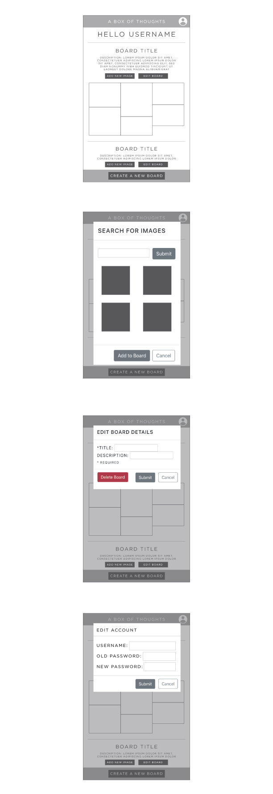

# Image Board Creator

## MVP/User Stories
1. Users login or register at the home screen.

    * Once registered/logged in, users can view their created boards or make a new board

2. Creating a new board

    * User inputs a required title for the board and an optional description.
    * When 'Add New Image' button is clicked, search modal pops up.
    * Upon submitting the search, app makes a call to the Unsplash API and populates up to 9 image options in the modal.
    * Click an image to select it and click submit button to add image to board.
    * Image is populated in the next available space on the board.

3. User can continue searching for new images until their board is complete.

    * User can create a board.
    * User can delete an image by clicking on it.
    * User can edit the title and description.
    * User can delete the entire board.
    * User can edit their username and password.

## Extras
1. Add a 'view more images' to search modal.
2. Auto-populate image credits below each board.
3. Themed boards that anyone can add to (social element).
4. Add option to share board.

## Wireframes
  